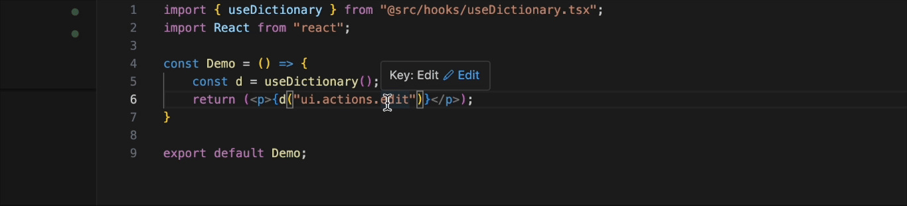

# Dictionary IntelliSense

Provides intelligent IntelliSense support for dictionary.json files in your workspace.

## Features

- Auto-completion intelliSense for dictionary keys

- Go to definition support

- OnHover Key information

- Edit dictionary values directly from your code
- Create new dictionary keys inline

## Requirements

- A dictionary.json file in your workspace (you can swap out this directory at any time)
- TypeScript/JavaScript/React files using the dictionary

## Usage

1. Open a TypeScript, JavaScript, or React file
2. Type `.` inside of a key string to trigger suggestions
3. Hover over dictionary keys to see values and edit options
4. Cmd+CLick or Click "Go to Definition" to jump to dictionary.json at the specific inline

## Extension Settings

This extension uses the following command:

* `dictionary-intellisense.selectDictionary`: Swap Dictionary File

## Release Notes

### 1.0.0

Initial release with core features:
- IntelliSense support
- Value editing
- Key creation

### 1.0.5

HotPatch with features:
- Hot Dictionary Switching
- Saved Dictionary Preferences

### 1.0.6

Updated Logo & Branding

### 1.0.7

Updated ReadMe